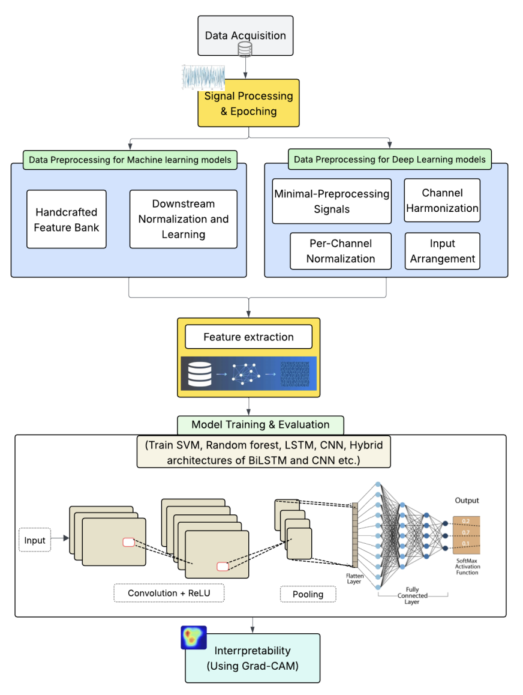
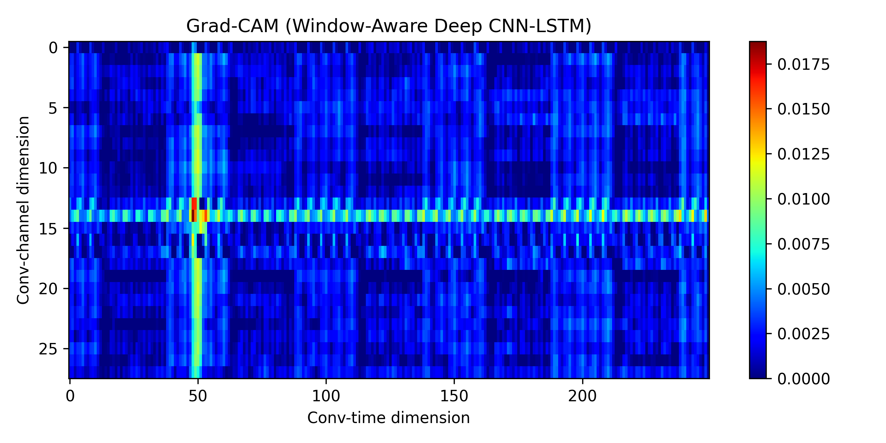

# EEG-Based Automatic Pain Recognition Using Machine Learning and Deep Learning Models

A complete pipeline for EEG-based pain estimation using both Deep Learning and Classical Machine Learning models. Works with 1000 Hz EEG segment data stored as `.npz` files and metadata in `index.csv`.

## 📂 Repository Structure

```
EEG-Pain-Estimation/
│
├── notebooks/
│   ├── __pycache__/
│   ├── Data loading and Analysis.ipynb
│   └── data.ipynb
│
├── results/
│   ├── figures/
│   │   ├── Confusion.matrix.png
│   │   ├── architecture.png
│   │   ├── gradcam_projected_on_eeg.png
│   │   ├── gradcam_windowaware.png
│   │   └── window_embedding_heatmap.png
│   └── results_best_model.json
│
├── saved_models/
│   ├── cnn_best.pth
│   ├── cnn_transformer_best.pth
│   ├── deep_cnn_lstm_best.pth
│   ├── lstm_best.pth
│   └── transformer_best.pth
│
├── scripts/
│   ├── dl_train_1000hz_gridsearch.py
│   ├── train_ml.py
│   └── train.py
│
├── src/
│   ├── data/
│   │   ├── dataset.py
│   │   ├── indexing.py
│   │   └── task.py
│   ├── gradcam/
│   │   └── gradcam.py
│   ├── models/
│   │   ├── cnn_baselines.py
│   │   ├── deep_cnn_lstm.py
│   │   └── window_aware_cnn_lstm.py
│   ├── training/
│   │   ├── classical_ml.py
│   │   └── trainer_dl.py
│   ├── utils/
│   │   ├── io_utils.py
│   │   └── seed.py
│   └── __init__.py
│
├── .gitignore
├── environment.yml
├── LICENSE
├── README.md
└── requirements.txt
```

## 📊 Dataset

This project uses the EEG pain dataset available on OpenNeuro:

**Dataset Link:** [https://openneuro.org/datasets/ds005280/versions/1.0.0](https://openneuro.org/datasets/ds005280/versions/1.0.0)

Download the dataset and preprocess it into the required format (see [Dataset Format](#-dataset-format) section below).

## 🚀 Quick Start

### 1. Install Dependencies

Using pip:

```bash
pip install -r requirements.txt
```

Using Conda:

```bash
conda env create -f environment.yml
conda activate eeg
```

### 2. Prepare Your Data

Place your data in the following structure:

```
data/
├── index.csv
└── npz/
    ├── sample_01.npz
    ├── sample_02.npz
    └── ...
```

### 3. Run Training Scripts

**Train Deep Learning Models with Grid Search:**

```bash
python scripts/dl_train_1000hz_gridsearch.py
```

**Train Classical ML Models:**

```bash
python scripts/train_ml.py
```

**Quick Training (Default):**

```bash
python scripts/train.py
```

## 🧠 Models Included

### Deep Learning Models

- **CNN Baselines** - Convolutional Neural Networks for spatial feature extraction
- **Deep CNN-LSTM** - Combined CNN and LSTM for spatial-temporal analysis 
- **Window-Aware Deep CNN-LSTM** - Enhanced model with window-based attention mechanism (Best performing)
- **CNN-Transformer** - Hybrid architecture combining CNN and Transformer

### Architecture Visualization



*Research workflow from EEG input through model training, and final classification.*

### Classical Machine Learning

- **Support Vector Machine (SVM)**
- **Random Forest**

Implemented in `src/training/classical_ml.py`

## 📊 Visualization & Interpretability

The project includes **Grad-CAM** (Gradient-weighted Class Activation Mapping) for model interpretability:

- Visualize which EEG channels and time windows contribute most to predictions
- Generate heatmaps overlaid on EEG signals
- Window-aware attention visualizations



*Example Grad-CAM visualization showing attention weights across EEG channels and time windows for pain detection.*

Example outputs in `results/figures/`:
- `gradcam_projected_on_eeg.png`
- `gradcam_windowaware.png`
- `window_embedding_heatmap.png`

## 📈 Results & Evaluation

### Saved Outputs

**Model Checkpoints:**

```
saved_models/
├── cnn_best.pth
├── cnn_transformer_best.pth
├── deep_cnn_lstm_best.pth
├── lstm_best.pth
└── transformer_best.pth
```

**Evaluation Metrics:**

```
results/results_best_model.json
```

Contains:
- Accuracy scores
- F1-scores (macro/weighted)
- Confusion matrices
- Per-class precision and recall
- Training/validation curves

**Visualizations:**

```
results/figures/
└── Confusion.matrix.png
```

## 📁 Dataset Format

### Required Files

**`index.csv`** - Metadata file with columns:
- Sample IDs
- Labels (pain levels/categories)
- Additional metadata

**`.npz` files** - EEG segments:

```python
# Each .npz file contains:
X   # shape: (channels, time_points)
    # 1000 Hz sampling rate
```

### Data Processing

The project uses three key modules in `src/data/`:

- `dataset.py` - PyTorch dataset classes for EEG data
- `indexing.py` - Data indexing and splitting utilities
- `task.py` - Task-specific data configurations (e.g., none_vs_pain)

## 🔧 Project Modules

### Core Components

**Data Loading** (`src/data/`)
- Custom PyTorch datasets for efficient EEG loading
- Stratified train/validation/test splits
- Data augmentation and preprocessing

**Models** (`src/models/`)
- Multiple deep learning architectures
- Modular and extensible design
- Pre-trained model loading support

**Training** (`src/training/`)
- `trainer_dl.py` - Deep learning training loops with early stopping
- `classical_ml.py` - SVM and Random Forest training with grid search
- Validation and checkpoint management

**Utilities** (`src/utils/`)
- `seed.py` - Reproducibility utilities
- `io_utils.py` - File I/O and path management

**Grad-CAM** (`src/gradcam/`)
- Model interpretability
- Visualization of important EEG features

## 🎯 Training Options

### Deep Learning with Grid Search

```bash
python scripts/dl_train_1000hz_gridsearch.py
```

Performs hyperparameter tuning over:
- Learning rates
- Batch sizes
- Network architectures
- Dropout rates

### Classical ML Training

```bash
python scripts/train_ml.py
```

Trains both SVM and Random Forest with optimized hyperparameters.

### Quick Training Mode

```bash
python scripts/train.py
```

Fast training with default parameters for quick experimentation.

## 🛠️ Requirements

- Python 3.8+
- PyTorch 1.10+
- NumPy
- Pandas
- Scikit-learn
- Matplotlib
- Seaborn
- tqdm

See `requirements.txt` or `environment.yml` for complete dependencies.

## 📊 Performance

The **Window-Aware Deep CNN-LSTM** model achieves the best performance:

- Effectively captures both spatial (EEG channel) and temporal patterns
- Robust across different pain estimation tasks
- Interpretable through Grad-CAM visualizations

## 📓 Notebooks

Explore the `notebooks/` directory for:

- `Data loading and Analysis.ipynb` - EDA and data exploration
- `data.ipynb` - Additional data analysis and preprocessing examples

## 📜 License

This project is licensed under the MIT License. See the [LICENSE](LICENSE) file for details.

## ✍️ Author
**Dilanjan Diyabalanage**

PhD Physics, Western University

**Aditi Satsangi**

MSc Computer Science, Western University

GitHub: [@AditiSatsangi](https://github.com/AditiSatsangi)

## 🤝 Contributing

Contributions are welcome! Please feel free to submit a Pull Request.

## 📧 Contact

For questions or feedback, please open an issue on the GitHub repository.

---

If you find this project useful, please consider giving it a star!

